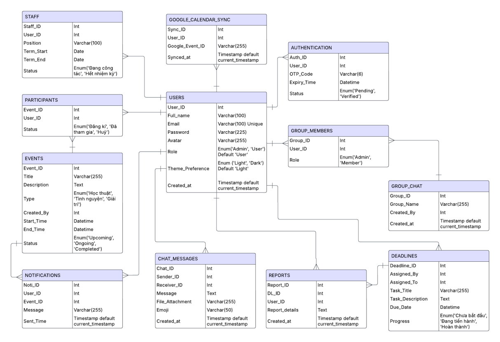

# NT106.P22.ANTT - LẬP TRÌNH MẠNG CĂN BẢN

_**Lời ngỏ:**_
_Chào mừng quý thầy cô và các bạn đến với ứng dụng đầu tiên của nhóm 4! Đây là sản phẩm mà cả nhóm đã cùng nhau lên ý tưởng, xây dựng và hoàn thiện với tất cả sự tâm huyết. Chúng mình hy vọng rằng ứng dụng này sẽ mang lại những trải nghiệm hữu ích và thú vị cho mọi người._
_Dù đã cố gắng hết sức, nhưng chắc chắn không thể tránh khỏi những thiếu sót. Nhóm rất mong nhận được những góp ý chân thành từ quý thầy cô và các bạn để có thể cải thiện và phát triển sản phẩm ngày càng tốt hơn. Sự ủng hộ và đóng góp của mọi người chính là động lực lớn nhất để nhóm tiếp tục học hỏi và hoàn thiện hơn trong những dự án tiếp theo._
_Một lần nữa, nhóm 4 xin chân thành cảm ơn! ❤️_

# I. ĐỒ ÁN MÔN HỌC

**Tên đề tài:** Hệ thống phát triển và quản lý dịch vụ Đoàn khoa Mạng máy tính và Truyền thông.

# II. DANH SÁCH THÀNH VIÊN

1. Nguyễn Đình Khang - **MSSV:** 23520694
2. Hoàng Bảo Phước - **MSSV:** 23521231
3. Đỗ Quang Trung - **MSSV:** 23521673

# III. GIỚI THIỆU VỀ ỨNG DỤNG

1. Database:
   

_Đang cập nhật_
